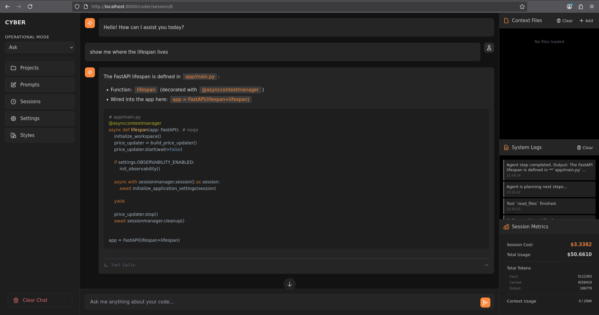

<div align="center">
  
</div>

<div align="center">
  
</div>

---
### discord: https://discord.gg/sKxfuMZq28
---

- It now supports diff patching without any llm! You can use with gemini, openai and anthropic models

## Features

**Cyber** is a local web coding assistant. You don't need to switch from your preferred IDE to use it!

### Simple Web Interface
Cyber features a responsive, server-rendered UI built with **FastAPI** and **HTMX**.
- **Lightweight & Fast**: No heavy client-side frameworks.
- **Clean Styling**: Uses custom theming and Highlight.js for styling.
- **Real-time Updates**: As agents work, the UI updates dynamically to show tool executions.

### Smart Context Manager
Managing what the LLM "sees" is very important. Cyber's **Context Manager** allows you to:
- **Browse & Select**: Navigate your project's file tree and select specific files to add to the active context.
- **Dynamic Context**: Files are loaded into the agent's context along with a smart repo map and chat history.
- **Token Awareness**: The system monitors context size to keep interactions within model limits.

### Multi-LLM Support
Cyber is model-agnostic and supports different providers and models. You can configure and switch between them on the fly:
- **Anthropic**: Sonnet, Opus.
- **OpenAI**: GPT-5, GPT-4.1, and mini versions.
- **Google**: Gemini 3, 3-flash, 2.5 Pro, and others.

### Operational Modes
Sessions in Cyber can run in different "modes" to tailor the agent's behavior to your current task:
- **Coder Mode**: The agent focuses on writing code, applying patches, and adhering to syntax rules. All tools are enabled here.
- **Planner Mode**: Planner just helps to create TODO lists based on multiple iterations.
- **Ask**: It works as a read-only mode. It won't patch, but will access all other reading tools plus the repo map.
- **Chat**: This is a free mode; it has no tools at all. Good for when we need to bother AI with random questions.
- **Single Shot**: This mode acts as a legacy mode. It will not use any tools at all, only the repo map and files loaded in context. It will apply patches that it outputs. In theory, any LLM will work with this mode, even the ones which have no tool calls. It can be less expensive too.

### Usage & Cost Tracking
Keep track of your API usage with built-in metrics. Cyber monitors:
- **Token Usage**: Input, output, and cached tokens per session.
- **Cost Estimation**: Real-time cost tracking based on provider pricing.

### Prompt Management
Cyber includes a robust system for managing system prompts and user presets:
- **Global Prompts**: Define standard prompts available across all projects.
- **Project-Specific Prompts**: Create prompts tailored to the specific conventions or needs of a single codebase. It will show only for that specific project.
- **Blueprints**: You can add any code examples to `~/cyber/blueprints` and they will show up here. They are converted to prompts and can be used as examples in your codebase.

---

## The Toolbelt

Cyber empowers agents with a set of core tools that allow them to interact with your codebase.

### 1. Read Tool
- Reads one or more files from the active project.
- Returns the full content of the file and formatted paths.
- Strictly confined to the active project directory; agents cannot access files outside the workspace.
- Allows searching files by glob. The LLM will usually chain with grep, which is very powerful.

### 2. Diff Patcher Tool
The engine for code modification. Currently, using OpenAI as the patcher.
- Generates and applies Unified Diffs to modify existing files.
    - The agent proposes a change in a standard `diff` format and calls the tools passing the diff patch.
    - The `DiffPatchService` applies the patch safely to the target file in the tool.

### 3. Grep Tool
The tool for discovery and navigation.
- Searches the codebase for patterns, keywords, or definitions.
- Supports regular expressions and multi-file searching by also using glob patterns for narrow search.
- Unlike standard grep, this tool returns matches with surrounding code context, helping the agent understand real code context.

---

### Smart Repo Map
When you open a project, Cyber generates a **Repository Map** to give the LLM a high-level understanding of the codebase structure without reading every file.

- **Tree-sitter Parsing**: Uses Tree-sitter to parse code into an Abstract Syntax Tree (AST) and extract definitions (classes, functions, variables).
- **PageRank Algorithm**: Builds a dependency graph of your code and runs PageRank to identify the most "important" files and definitions. Uses active context as the base of importance.
- **Compact Representation**: Generates a condensed summary of the repo structure, allowing the agent to "see" the entire architecture in a small number of tokens.

### AST-Aware Grep
Searching code requires more than just string matching. Cyber uses **AST-Aware Grep** (via `grep_ast` thanks to Aider!) to improve search results.

- **Structure Preservation**: When a match is found, Cyber includes the surrounding class or function definition in the output.
- **Contextual Understanding**: This ensures the agent knows that `def connect()` belongs to `class Database` and not `class WiFi`, for example.

---

## Workspace & Projects

Cyber is designed to manage multiple projects using a convention-based filesystem approach.

### The `~/cyber` Directory
When you run Cyber, it expects (or creates) a workspace directory in your home folder:

```text
~/cyber/
└── projects/
    ├── my-awesome-app/
    ├── legacy-codebase/
    └── experiment-v1/
```

### Project Switching
- **Auto-Discovery**: Any top-level folder inside `~/cyber/projects/` is automatically detected as a project.
- **UI Switching**: You can switch between active projects instantly from the web interface.
- **Isolation**: Context, chat history, and prompt settings are scoped to the active project.

---

## Running Cyber

You can run Cyber using Docker (recommended for isolation) or Podman with `export USE_PODMAN=1`.

**Clone the app**:
   ```bash
     git clone https://github.com/marcius-llmus/cyber.git
   ```

**Build and Run**:
   ```bash
     make build && make up
   ```

**Access the App**:
   Open your browser to `http://localhost:8000`.

**Volume Mapping**:
   The container maps your local `~/cyber` directory to `/app/workspace` inside the container.
   - Any folder you put in `~/cyber/projects` on your host machine is immediately visible to the app in `Projects`.
   - Changes made by the agent are written directly to that folder. You can use this app along with your favorite IDE.

---

## Development & Makefile

The repository includes a `Makefile` to streamline common development tasks.

### Initialization
Ensure you have the necessary tools installed:
```bash
  make init
```

### Running the App
Start the Docker container in detached mode:
```bash
  make up
```

View logs:
```bash
  make logs
```

Stop the container:
```bash
  make down
```

### Code Quality
**Linting**:
Runs `ruff` and `black` to check for style issues and errors.
```bash
  make lint
```

**Formatting**:
Automatically fixes style issues using `ruff` and `black`.
```bash
  make format
```

**Testing**:
Runs the test suite using `pytest`.
```bash
  make test
```

---

## Roadmap
Here are some of the things I aim to implement (more in TODO):

- Add monthly usage per model and provider, with detailed cost tracking
- Add prompt improvement and versioning based on conversation (a prompt manager)
- Add comprehensive planning with a feature-based approach
- Add multimodality
- Add slash commands
- Add MCP Integration
- Add possibility of RAG through semantic search with codeblock chunks, similar to Cursor
- Many more LLM providers
- Create in-app network for prompts, agents, flows, skills, and general knowledge for LLMs


## License
MIT
